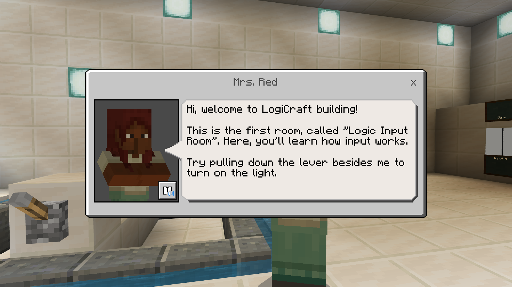

# LogiCraft

## Showcase Video
[](https://www.youtube.com/watch?v=mCD_LAdX4Bw)

## Daftar Isi
* [Apa itu LogiCraft](#apa-itu-logicraft)
* [Fitur dalam world](#fitur-dalam-world)
* [Cara menjalankan world](#cara-menjalankan-world)
* [Cara melakukan save and load](#cara-melakukan-save-and-load)

## Apa itu LogiCraft?
Di LogiCraft, pemain dapat mempelajari gerbang logika mulai dari yang paling dasar dengan metode pembelajaran yang interaktif dan praktis. LogiCraft memiliki banyak ruangan dimana tiap ruangan terdapat materi mengenai salah satu satu jenis gerbang logika.

## Fitur dalam world

### NPC yang membantu pemain memahami gerbang logika



### Metode pembelajaran gerbang logika yang interaktif dan praktis


### Tabel kebenaran gerbang logika


### Area dimana pemain dapat membangun gerbang logika sendiri


### Pemain harus menyelesaikan puzzle logic gate untuk membuka pintu ke ruangan selanjutnya


### Terdapat quiz room dimana pemain harus menjawab semua pertanyaan dari NPC untuk melanjutkan ke ruangan selanjutnya


### Serta free to build room dengan fitur save and load


## Cara menjalankan world
1. Jalankan minecraft, lalu klik Play


2. Lalu, klik import dan pilih di direktori ```./World/GIGAGO V1.mcworld``` hingga muncul notifikasi "Level import finished successfully"


3. Selanjutnya klik VIEW MY WORLD, lalu klik world ```GIGAGO TRY TO FIX``` dan klik Play


4. Tunggu minecraft memuat dunianya


5. Setelah dunianya termuat, tekan 'C' untuk membuka code builder dan klik tombol import a project.


6. Import project yang berada di ```./Code/minecraft-GIGAGO.mkcd``` lalu klik Go Ahead.


7. Tekan 'C' lagi untuk menutup code builder.

8. Selamat bermain

## Cara melakukan save and load
Saat kamu sudah di garden. Kamu dapat menggunakan fitur save dan load. Kamu dapat menggunakan 3 slot save.
Untuk melakukan save, kamu dapat mengirim pesan melalui chat dengan bentuk ```save[slot]```. Sebagai contoh, untuk menyimpan di slot pertama, kamu dapat mengirim pesan ```save1```.
Untuk melakukan load, kamu dapat mengirim pesan melalui chat dengan bentuk ```load[slot]```. Sebagai contoh, untuk memuat simpanan yang ada di slot pertama, kamu dapat mengirim pesan ```load1```.

